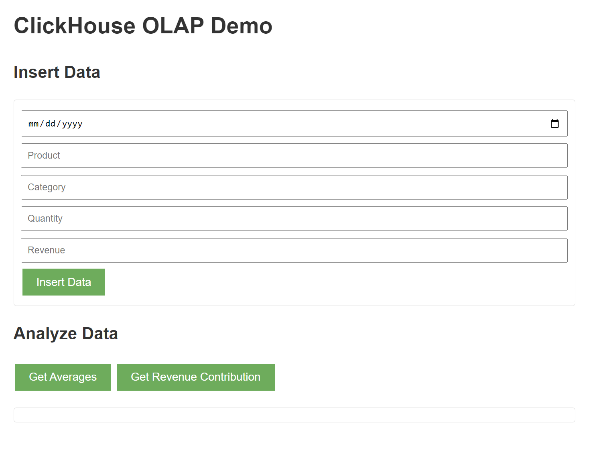
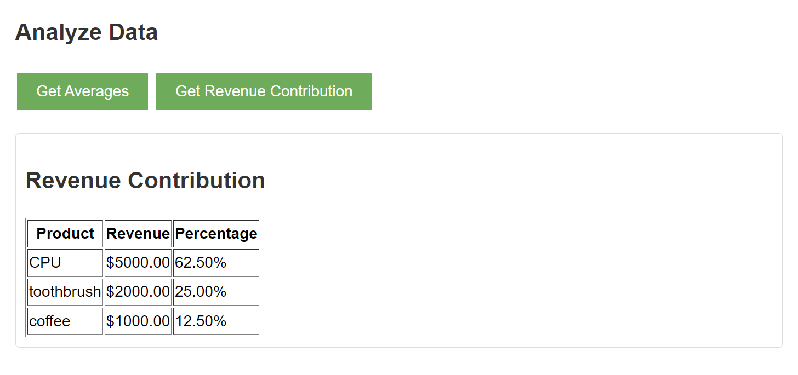

# Apiary Tutorial and Demo

This tutorial will show you how to use Apiary's new ClickHouse backend to analyze sales data.
To get started, let's first install some dependencies:

```shell
sudo apt install openjdk-11-jdk maven libatomic1
```

Next, let's compile Apiary. In the Apiary root directory, run:

```shell
mvn -DskipTests package
```

Then, let's start ClickHouse from a Docker image. We recommend you [configure Docker](https://docs.docker.com/engine/install/linux-postinstall/) so it can be run by non-root users.

```shell
scripts/initialize_clickhouse_docker.sh
```

Now, it's time to build a website!
We want to build a simple application where you can
add in sales data to a built-in form, and analyze this data with
averages and revenue contributions..
We'll build the site using [Spring Boot](https://spring.io/projects/spring-boot),
but call Apiary functions to handle operations on website data.
Then, once the website is running,
we'll show how Apiary's new data provenance features make it easy
to monitor website activity and provide
cool features like easily rolling back
your database and application to any previous point in time.

### Tables 
The first thing we need to do is create a database table in ClickHouse
to store the information our site needs.
We create and write to this table with functions `createTableIfNotExists` and `insertData`
when the users submits the data.
Here's what the insert data function looks like:

```java
public void insertData(String date, String product, String category, int quantity, double revenue) throws SQLException {
        String sql = "INSERT INTO sales (date, product, category, quantity, revenue) VALUES (?, ?, ?, ?, ?)";
        try (Connection conn = dataSource.getConnection();
             PreparedStatement stmt = conn.prepareStatement(sql)) {
            stmt.setDate(1, java.sql.Date.valueOf(date));
            stmt.setString(2, product);
            stmt.setString(3, category);
            stmt.setInt(4, quantity);
            stmt.setDouble(5, revenue);
            stmt.addBatch();
            stmt.executeBatch();
        }
    }

```

### Functions

Now, let's write some functions.
We already talked about creating the `sales` table and writing data into it.
Now, we have to analyze the data in the OLAP.
One form of analysis we are using is getting averages of the data.
The function for this is written in regular Java
with embedded SQL, and it looks like:

```java
public List<Map<String, Object>> getAverages() throws SQLException {
        String sql = "SELECT AVG(revenue) AS avg_revenue FROM sales";
        List<Map<String, Object>> result = new ArrayList<>();
        try (Connection conn = dataSource.getConnection();
             PreparedStatement stmt = conn.prepareStatement(sql);
             ResultSet rs = stmt.executeQuery()) {
            while (rs.next()) {
                Map<String, Object> row = new HashMap<>();
                row.put("avg_revenue", rs.getDouble("avg_revenue"));
                result.add(row);
            }
        }
        return result;
    }

```

This function is able to read from the OLAP database, then
use logic to get the averages of the revenue and print it onto the application.

Back in Spring, we call the `getAverages` function
whenever we get a request to our site:
```java
@GetMapping("/averages")
    public ResponseEntity<List<Map<String, Object>>> getAverages() {
        try {
            return ResponseEntity.ok(clickHouseService.getAverages());
        } catch (SQLException e) {
            return ResponseEntity.status(500).body(null);
        }
    }
```

Similarly, we get the revenue contribution in the same way,
using some logic shown here:

``` java
public List<Map<String, Object>> getRevenueContribution() throws SQLException {
        String sql = "SELECT product, SUM(revenue) AS product_revenue, " +
                     "(SUM(revenue) / (SELECT SUM(revenue) FROM sales) * 100) AS revenue_percentage " +
                     "FROM sales GROUP BY product ORDER BY product_revenue DESC";
        List<Map<String, Object>> result = new ArrayList<>();
        try (Connection conn = dataSource.getConnection();
             PreparedStatement stmt = conn.prepareStatement(sql);
             ResultSet rs = stmt.executeQuery()) {
            while (rs.next()) {
                Map<String, Object> row = new HashMap<>();
                row.put("product", rs.getString("product"));
                row.put("product_revenue", rs.getDouble("product_revenue"));
                row.put("revenue_percentage", rs.getDouble("revenue_percentage"));
                result.add(row);
            }
        }
        return result;
    }

```

### Tying it Together

With our functions written, it's almost time to launch our site.
We'll now tell the [Spring controller](src\main\java\com\clickhousedemo\Application.java)
to launch an Apiary worker on startup to start the application:

```java
@SpringBootApplication
public class Application {
    public static void main(String[] args) {
        SpringApplication.run(Application.class, args);
    }

    @Bean
    public CommandLineRunner commandLineRunner(ClickHouseService clickHouseService) {
        return args -> {
            System.out.println("Application is up and running!");
        };
    }
}

```

Everything's ready!  To start the site, run in the `clickhouse-demo` root directory:

    mv spring-boot:run

If this doesn't work, you may need to repackage:

    mvn clean && mvn package && mvn spring-boot:run

Then, navigate to `localhost:8080` to view this new social network! You should see the Nectar homepage:


And this is an example of the revenue contribution of randomly inserted data:
