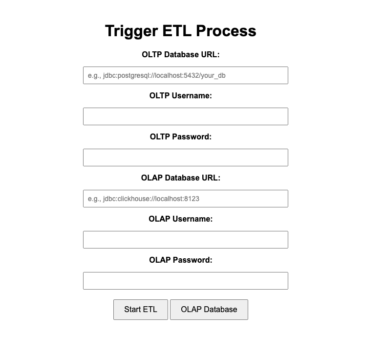

# Apiary ETL Tutorial and Demo

This tutorial will show you how to build a simple social network
web application using Apiary and [Spring Boot](https://spring.io/projects/spring-boot) for ETL process.
We use Apiary's Postgres (for OLTP) and ClickHouse (for OLAP) as backends.


To get started, let's first install some dependencies:

```shell
sudo apt install openjdk-11-jdk maven libatomic1
```

Next, let's compile Apiary. In the Apiary root directory, run:

```shell
mvn -DskipTests package
```


Then, let's start Docker images for Postgres and ClickHouse. We recommend you [configure Docker](https://docs.docker.com/engine/install/linux-postinstall/) so it can be run by non-root users.

- For Postgres
    ```
    scripts/initialize_postgres_docker.sh
    ```

- For ClickHouse
    ```shell
    scripts/initialize_clickhouse_docker.sh
    ```

Now, it's time to build a website!
We want to build a simple application where you can do ETL process from Postgres Database to ClickHouse, i.e. OLTP to OLAP.

### Data Preperation 
The first thing we need to do is import a dataset in Postgres
to store the information our site needs. Instructions for adding dataset to OLTP and OLAP is described in this [UPDATE_DS.md](https://github.com/EC528-Fall-2024/hybrid-tx-analytical-epoxy/blob/main/apiary/UPLOAD_DS.md). Our goal is to perform ETL on a simple `campaign_product_subcategory` dataset.

Note here, we DO NOT need to import any dataset to ClickHouse since we will detect and create new datasets depends on the given OLTP dataset in Postgres.

## Functions
### ETL Flow: Extract, Transform, Load

The ETL process will perform a **full load** for data from Postgre to ClickHouse using the following classes:

- `ExtractFromPostgres.java`: Extracts the data from PostgreSQL into a ResultSet.
- `LoadToClickHouse.java`: Loads the extracted data from PostgreSQL into ClickHouse.
- `ETLService.java`: Orchestrates the ETL process and ensures the data is moved smoothly.

Let's take a closer look at these functions.

### `ExtractFromPostgres.java`

First, we need to establish connection with Postgres. If you constructed docker container differently, then you might need to modify these as your need.
```java
private static final String POSTGRES_URL = "jdbc:postgresql://localhost:5432/campaign_product_subcategory";
private static final String POSTGRES_USER = "postgres";
private static final String POSTGRES_PASSWORD = "dbos";

// Establish Connection
Connection connection = DriverManager.getConnection(POSTGRES_URL, POSTGRES_USER, POSTGRES_PASSWORD);
System.out.println("Connected to PostgreSQL!");
```

Then, we do extract all data from this dataset with a `SELECT *` query since full load imports all data from one table to another.
```java
// Execute SQL query to extract data
Statement statement = connection.createStatement();
String query = "SELECT * FROM campaign_product_subcategory";
ResultSet resultSet = statement.executeQuery(query);
```

### `LoadToClickHouse.java`
Similarly, the first step is also establishing connection with ClickHouse.
```java
private static final String CLICKHOUSE_URL = "jdbc:clickhouse://localhost:8123";
private static final String CLICKHOUSE_USER = "default";
private static final String CLICKHOUSE_PASSWORD = "";

Connection clickhouseConn = DriverManager.getConnection(CLICKHOUSE_URL, CLICKHOUSE_USER, CLICKHOUSE_PASSWORD);
System.out.println("Connected to ClickHouse!");
```

Since ClickHouse has 2 default ports 8123 and 9000, where 8123 is the defaul HTTP interface endpoint and 9000 is the native TCP/IP protocal endpoint, we can add detection code for checking whether 
```java
if (clickhouseConn != null) {
    statement = clickhouseConn.createStatement();
} else {
    System.err.println("ClickHouse connection is null!");
}
```
Here's the reason why: 

ClickHouse JDBC drivers generally prefer the **HTTP protocol** because it allows them to leverage the full power of REST APIs, and it’s easier to work with across firewalls and various systems.

Since our JDBC connection string begins with `jdbc:clickhouse://` and it is HTTP-based, it defaults to 8123.

Port 9000 is only used when we configure the connection to use a native driver or binary protocol.

After making sure the connection is successfully established, we want to load data. We cann't guarentee whether the database exists in ClickHouse, so we detect and create if absent.

```java
Statement statement = null;
// Step 1: Check if the ClickHouse database exists, if not, create it
String databaseName = "campaign_product_subcategory"; // Name of OLAP database
statement.executeUpdate("CREATE DATABASE IF NOT EXISTS " + databaseName);
System.out.println("Database checked/created: " + databaseName);

// Step 2: Check if the table exists, if not, create it
String createTableSQL = "CREATE TABLE IF NOT EXISTS " + databaseName + ".campaign_product_subcategory (" +
        "campaign_product_subcategory_id UInt32, " +
        "campaign_id UInt32, " +
        "subcategory_id UInt32, " +
        "discount Float32" +
        ") ENGINE = MergeTree() ORDER BY campaign_product_subcategory_id";
statement.executeUpdate(createTableSQL);
System.out.println("Table checked/created: campaign_product_subcategory");
```

After ensuring the table exists, we can prepare for data insertion.

```java
String insertSQL = "INSERT INTO " + databaseName + ".campaign_product_subcategory " +
        "(campaign_product_subcategory_id, campaign_id, subcategory_id, discount) " +
        "VALUES (?, ?, ?, ?)";
clickhouseStmt = clickhouseConn.prepareStatement(insertSQL);
```

We loop through the PostgreSQL result set and insert the data into ClickHouse
```java
while (resultSet.next()) {
    clickhouseStmt.setInt(1, resultSet.getInt("campaign_product_subcategory_id"));
    clickhouseStmt.setInt(2, resultSet.getInt("campaign_id"));
    clickhouseStmt.setInt(3, resultSet.getInt("subcategory_id"));
    clickhouseStmt.setFloat(4, resultSet.getFloat("discount"));

    clickhouseStmt.addBatch(); // Add to batch for efficiency
}
```

After the batches are set, we execute the batch insert
```java
clickhouseStmt.executeBatch();
System.out.println("Data successfully loaded into ClickHouse!");
```

We can then end connection after everything is successfully executed.

### `ETLService.java`
Since we have already defined functions for extract and load, we now can call these functions to run ETL process.
```java
// Extract data from PostgreSQL
resultSet = ExtractFromPostgres.extractData();

// Load the data into ClickHouse
LoadToClickHouse.loadData(resultSet);
```

## Tying it Together
With our functions written, it's almost time to launch our site.
We'll now tell the [Spring controller](src\main\java\com\clickhousedemo\Application.java)
to launch an Apiary worker on startup to start the application:
```java
@SpringBootApplication
public class ETLDemoApplication {
    public static void main(String[] args) {
        SpringApplication.run(ETLDemoApplication.class, args);
    }
}
```

Everything's ready!  To start the site, run in the `etl-demo` root directory:
```shell
mvn clean && mvn package && mvn spring-boot:run
```

Then, navigate to `localhost:8080` to view this new social network! You should see the Nectar homepage:


We can start ETL process by clicking on the button.
